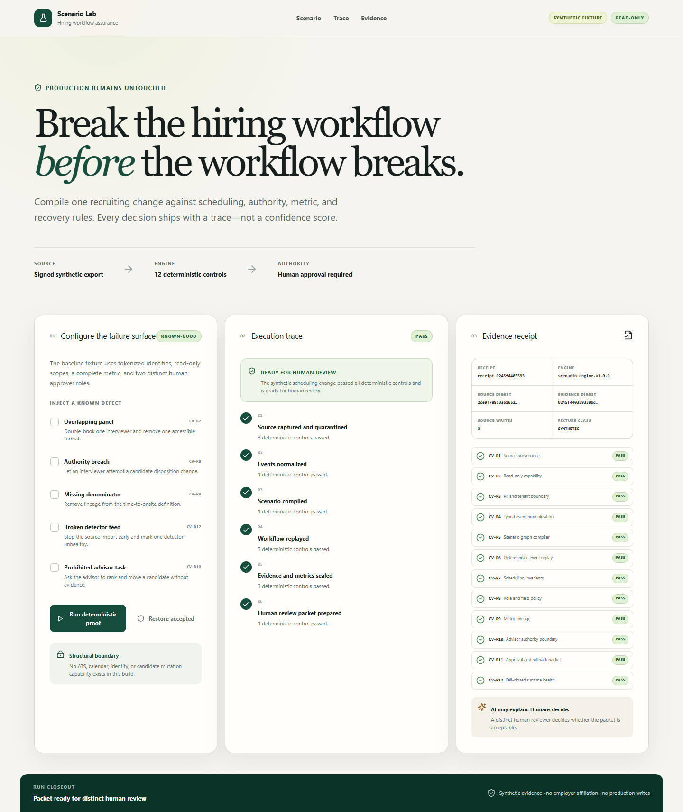
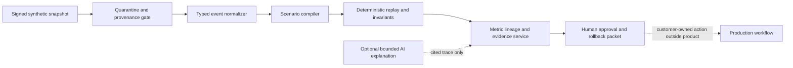

# Hiring Workflow Scenario Lab

Hiring Workflow Scenario Lab is a working, read-only product vertical for testing a recruiting workflow change before anyone changes production. It turns a tokenized hiring-event snapshot and a proposed interview-scheduling policy into a deterministic trace, twelve control decisions, an evidence receipt, and a human review packet.

> Independent work sample. This repository is not affiliated with, endorsed by, or built for Ashby. It uses no Ashby customer data, private APIs, internal roadmap information, or production systems. All runnable records are synthetic.



## The problem

Recruiting workflow changes cross several systems and owners at once: ATS stages, interview calendars, role permissions, funnel metrics, accessibility needs, and approval evidence. A locally correct configuration can still create a globally broken workflow. Manual UAT is difficult to repeat and usually produces weak rollback evidence.

The implemented wedge is one complete decision: **may this interview-scheduling change advance to human review?**

The primary user is a Recruiting Operations owner. Coordinators, ATS administrators, analytics owners, security partners, and change approvers inspect the same trace from their own authority boundary.

## What is implemented

The repository contains a production-shaped vertical, not a marketing mockup:

- a responsive Next.js 16 application with the complete known-good, blocked, indeterminate, retry, and restore journey;
- a typed server-side scenario engine with source, event, scenario, scheduling, RBAC, metric, advisor, approval, and detector-health contracts;
- twelve deterministic controls (`CV-R1` through `CV-R12`) with named bad fixtures, clean controls, stable SHA-256 evidence digests, repeat checks, and detector mutation canaries;
- a typed `POST /api/simulations` boundary and a no-write health endpoint;
- tokenized synthetic fixtures and structural absence of ATS, calendar, identity, and candidate mutation adapters;
- a proposed Supabase persistence schema with RLS enabled and tenant policies declared for every table;
- local proof for unit, acceptance, API, security, accessibility, recovery, mutation, type, lint, build, and browser journeys;
- operator, architecture, security, recovery, and evidence documentation.

## The real workflow

1. Start from the signed synthetic hiring-event snapshot.
2. Choose the known-good scheduling change or inject a named failure.
3. Run the deterministic proof.
4. Inspect the source, normalization, compile, replay, evidence, and approval trace.
5. Inspect each requirement decision and the receipt digests.
6. Repair a blocked input or restore the accepted scenario.
7. Hand a passing packet to distinct human approvers. The product never approves its own output and never changes production.

### Reproduce the demo

```powershell
npm.cmd ci --no-audit --no-fund
npm.cmd run dev
```

Open `http://localhost:3000` and:

1. run the default fixture and confirm `PASS` plus `READY FOR HUMAN REVIEW`;
2. enable **Overlapping panel**, rerun, and confirm `CV-R7` blocks the packet;
3. enable **Broken detector feed**, rerun, and confirm the result is `INDETERMINATE`, never green;
4. select **Restore accepted** and rerun to recover the original receipt digest.

No environment variables, accounts, credentials, or provider connections are required.

## Architecture



Dependency direction is inward: the UI and API call typed services; services call pure detectors and the canonical evidence encoder. No detector imports UI, provider, or persistence code. The runnable fixture is in memory. The Supabase migration is a reviewed proposal, not proof of a live database.

See [architecture](docs/architecture.md) and [ADR-0001](docs/adr/0001-deterministic-read-only-vertical.md).

## Deterministic, AI, and human split

| Layer | Authority | Implemented state |
|---|---|---|
| Deterministic software | Validate provenance, tenant/PII boundary, event types, graph, replay, schedule, RBAC, metric lineage, packet completeness, and detector health | Implemented and tested |
| AI | Explain a supplied trace with evidence citations; no ranking, disposition, provider tools, or approval | Boundary implemented; no model call or runtime dependency |
| Human | Approve source/privacy scope, accept unresolved risk, approve the exact change and rollback packet, and separately execute any production change | Explicit required gate; no approval is simulated |

## Security and privacy

- Synthetic-first. The runnable product contains no real candidate or employer records.
- Candidate identity is tokenized; protected attributes are excluded from the initial contract.
- Source scopes are read-only and there are no provider mutation adapters.
- Evidence receipts state `zeroProductionWrites: true` and bind source, scenario, engine, rule, and decision digests.
- Partial imports and unhealthy detectors return `INDETERMINATE`.
- The proposed schema enables RLS on every table and checks tenant identity on every policy.
- Secrets are neither required nor stored. `.env*` is ignored except for a non-secret example if one is added later.

Threat model and limitations: [security and privacy](docs/security-privacy.md).

## Commercial hypothesis and evidence boundary

The commercial hypothesis is that a Recruiting Operations buyer may pay for repeatable, cross-system assurance on high-risk workflow changes. That hypothesis is **not validated**.

Unknowns include buyer demand, willingness to pay, provider access, privacy acceptance, production reliability, onboarding effort, operating cost, calibration, and repeat use. This repository contains no users, customers, pilots, testimonials, demand evidence, revenue, outcome benchmarks, or employer endorsement. UI and test evidence prove only the local product candidate described here.

Implemented versus proposed:

| Capability | State |
|---|---|
| Synthetic scheduling-change journey | Implemented |
| Twelve deterministic acceptance controls | Implemented |
| Evidence receipt, retry, restore, and human handoff | Implemented |
| Supabase schema and RLS contract | Proposed source only; not applied |
| ATS/calendar/identity/warehouse connection | Proposed; no provider action |
| Runtime AI explanation | Proposed; deterministic product works without it |
| Real customer pilot, calibration, or commercial validation | Unknown / not performed |
| Production deployment | Not authorized / not performed |

## Local setup

Requirements: Node.js 24+ and npm 11+.

```powershell
git clone https://github.com/shrishmanglik/hiring-workflow-scenario-lab.git
cd hiring-workflow-scenario-lab
npm.cmd ci --no-audit --no-fund
npm.cmd run dev
```

The application runs at `http://localhost:3000`. The API health contract is at `http://localhost:3000/api/health`.

## Verification

```powershell
npm.cmd run typecheck
npm.cmd run lint
npm.cmd test
npm.cmd run test:accessibility
npm.cmd run test:security
npm.cmd run test:recovery
npm.cmd run test:mutation
npm.cmd run build
```

Critical adjacent-check proof:

```powershell
$env:DISABLE_DETECTOR='DET-CV-R7'
npm.cmd run control:critical  # must exit non-zero because the bad overlap falsely passes
Remove-Item Env:DISABLE_DETECTOR
npm.cmd run control:critical  # must pass
```

The exact latest local counts and commands are recorded in [verification evidence](docs/evidence/verification.md). Hosted CI is intentionally one full pull-request validation plus one small post-merge smoke, with concurrency cancellation and timeouts.

## Operating and recovery

- [Operator runbook](docs/operator-runbook.md)
- [Recovery model](docs/recovery.md)
- [Data and RLS contract](docs/data-and-rls.md)
- [Evidence manifest](docs/evidence/manifest.md)
- [Blueprint digest](docs/evidence/blueprint-digest.md)

## Roadmap

1. Obtain independent review of this pull request and its evidence.
2. Run buyer discovery before adding providers or production persistence.
3. If demand survives, validate a signed-export workflow with privacy and legal review.
4. Add provider-specific read-only conformance only after capability verification.
5. Measure prediction against observed outcomes before using predictive language.

Deployment, provider integration, customer data, pricing, and external use require separate authority and evidence.
